# 🚀 CI/CD Pipeline & Deployment Guide

This document explains the Continuous Integration and Continuous Deployment (CI/CD) pipeline for the EU VAT Refund Application.

## 📋 Pipeline Overview

Our CI/CD pipeline consists of four main jobs that run automatically on every push to the `main` branch:

```mermaid
graph TD
    A[Push to main] --> B[🧪 Test Job]
    B --> C[🏗️ Build Job]
    C --> D[🚀 Deploy Job]
    D --> E[✅ Verify Job]
    
    B1[Unit Tests] --> B
    B2[Integration Tests] --> B
    B3[Smoke Tests] --> B
    B4[Coverage Report] --> B
    
    C1[Frontend Build] --> C
    C2[Backend Build] --> C
    
    D1[Firebase Hosting] --> D
    D2[Cloud Functions] --> D
    D3[Security Rules] --> D
    
    E1[Health Checks] --> E
    E2[Performance Tests] --> E
```



## 🧪 Job 1: Testing Pipeline

**Purpose**: Ensure code quality and functionality before deployment

**Steps**:
1. **Setup Environment**: Node.js 18, npm cache
2. **Install Dependencies**: `npm ci` in functions directory
3. **Start Firebase Emulators**: Firestore + Storage emulators
4. **Run Test Suite**:
   - Unit Tests (`npm run test:unit`)
   - Integration Tests (`npm run test:integration`) 
   - Smoke Tests (`npm run test:smoke`)
   - Full Coverage Report (`npm run test:all`)
5. **Upload Coverage**: Send coverage report to Codecov
6. **Cleanup**: Stop emulators

**Failure Handling**: If ANY test fails, the entire pipeline stops immediately.

## 🏗️ Job 2: Build Pipeline

**Purpose**: Compile and prepare frontend and backend for deployment

**Frontend Build**:
- Install dependencies (`npm ci`)
- Build for production (`npm run build`)
- Set production environment variables
- Upload build artifacts

**Backend Build**:
- Install dependencies (`npm ci`)
- Compile TypeScript (`npm run build`)
- Upload compiled artifacts

**Dependencies**: Only runs if Test Job succeeds

## 🚀 Job 3: Deployment Pipeline

**Purpose**: Deploy to Firebase production environment

**Security**:
- Runs only on `main` branch
- Uses GitHub Secrets for authentication
- Service account with minimal required permissions

**Deployment Steps**:
1. **Authentication**: Firebase service account + CLI token
2. **Environment Configuration**: Set production secrets
3. **Deploy Frontend**: Firebase Hosting
4. **Deploy Backend**: Cloud Functions
5. **Deploy Security Rules**: Firestore + Storage rules
6. **Cleanup**: Remove sensitive files

**Dependencies**: Only runs if both Test and Build jobs succeed

## ✅ Job 4: Post-Deployment Verification

**Purpose**: Verify deployment success and system health

**Verification Steps**:
1. **Frontend Health Check**: HTTP 200 response
2. **Backend Health Check**: Cloud Functions availability
3. **Performance Check**: Basic performance metrics
4. **Production Smoke Tests**: Critical user journeys

## 🔐 Required GitHub Secrets

### Firebase Configuration
```bash
FIREBASE_TOKEN                    # Firebase CLI token
FIREBASE_SERVICE_ACCOUNT_PROD     # Production service account JSON
```

### External API Keys
```bash
SENDGRID_API_KEY                  # Email service
SENDGRID_FROM_EMAIL               # From email address
EU_VAT_SUBMISSION_ENDPOINT        # EU VAT API endpoint
EU_VAT_API_KEY                    # EU VAT API authentication
```

## 🛠️ Setup Instructions

### 1. Create Production Firebase Project

```bash
# Create project
firebase projects:create eu-vat-refund-app-prod

# Configure project
firebase use --add eu-vat-refund-app-prod
firebase use eu-vat-refund-app-prod
```

### 2. Generate Firebase Secrets

```bash
# Generate CLI token
firebase login:ci
# Copy token to FIREBASE_TOKEN secret

# Generate service account
# 1. Go to Firebase Console → Project Settings → Service Accounts
# 2. Generate new private key
# 3. Copy JSON to FIREBASE_SERVICE_ACCOUNT_PROD secret
```

### 3. Configure GitHub Repository

```bash
# Install GitHub CLI
gh auth login

# Add secrets (interactive)
gh secret set FIREBASE_TOKEN
gh secret set FIREBASE_SERVICE_ACCOUNT_PROD
gh secret set SENDGRID_API_KEY
gh secret set SENDGRID_FROM_EMAIL
gh secret set EU_VAT_SUBMISSION_ENDPOINT
gh secret set EU_VAT_API_KEY
```

### 4. Set Firebase Function Configuration

```bash
firebase functions:config:set \
  sendgrid.api_key="$SENDGRID_API_KEY" \
  sendgrid.from_email="$SENDGRID_FROM_EMAIL" \
  eu_vat.submission_endpoint="$EU_VAT_SUBMISSION_ENDPOINT" \
  eu_vat.api_key="$EU_VAT_API_KEY" \
  --project eu-vat-refund-app-prod
```

## 🔄 Deployment Workflow

### Automatic Deployment (Recommended)

```bash
# 1. Make changes in feature branch
git checkout -b feature/my-new-feature
# ... make changes ...
git commit -m "Add new feature"
git push origin feature/my-new-feature

# 2. Create pull request
gh pr create --title "Add new feature" --body "Description of changes"

# 3. Merge to main (triggers deployment)
gh pr merge --squash
```

### Manual Deployment (Emergency)

```bash
# Deploy specific components
firebase deploy --only hosting --project eu-vat-refund-app-prod
firebase deploy --only functions --project eu-vat-refund-app-prod
firebase deploy --only firestore:rules --project eu-vat-refund-app-prod
```

## 📊 Monitoring & Alerts

### GitHub Actions Dashboard
- View pipeline status: `https://github.com/your-org/vat-refund-app/actions`
- Monitor deployment history and logs
- Set up notification preferences

### Firebase Console
- Production project: `https://console.firebase.google.com/project/eu-vat-refund-app-prod`
- Monitor Cloud Functions logs
- Check Firestore usage and performance
- Review Storage metrics

### Application URLs
- **Production Frontend**: `https://eu-vat-refund-app-prod.web.app`
- **Admin Panel**: `https://console.firebase.google.com/project/eu-vat-refund-app-prod`

## 🚨 Troubleshooting

### Common Pipeline Failures

#### Test Failures
```bash
# Run tests locally to debug
cd functions
npm install
npm run test:all
```

#### Build Failures
```bash
# Check TypeScript compilation
cd functions
npm run build

# Check frontend build
cd frontend  
npm run build
```

#### Deployment Failures
```bash
# Check Firebase authentication
firebase projects:list
firebase use eu-vat-refund-app-prod

# Verify function configuration
firebase functions:config:get --project eu-vat-refund-app-prod
```

### Emergency Rollback

```bash
# Rollback to previous version
firebase hosting:channel:deploy previous --project eu-vat-refund-app-prod
firebase functions:delete functionName --project eu-vat-refund-app-prod
```

## 🔒 Security Best Practices

1. **Secret Management**: Never commit secrets to repository
2. **Branch Protection**: Require PR reviews before merging to main
3. **Service Accounts**: Use minimal required permissions
4. **Regular Rotation**: Rotate API keys and service accounts monthly
5. **Audit Logs**: Monitor deployment and access logs regularly

## 📈 Performance Optimization

- **Build Caching**: Dependencies cached between builds
- **Parallel Jobs**: Test and Build jobs run in parallel when possible
- **Incremental Deployments**: Only changed functions are redeployed
- **CDN**: Frontend served via Firebase Hosting CDN

## 🎯 Success Metrics

- **Deployment Frequency**: Target multiple deployments per week
- **Lead Time**: < 10 minutes from push to production
- **Change Failure Rate**: < 5% of deployments cause issues
- **Recovery Time**: < 5 minutes to rollback if needed
